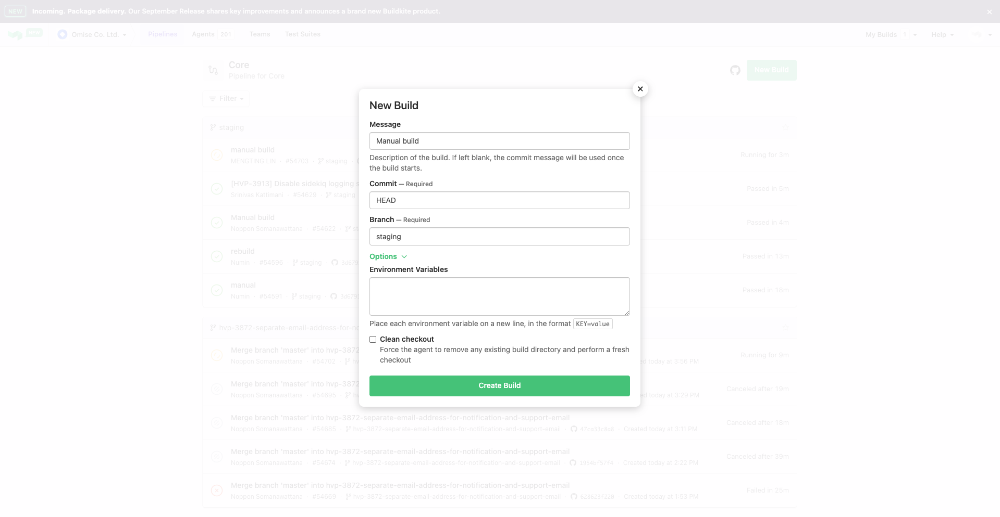
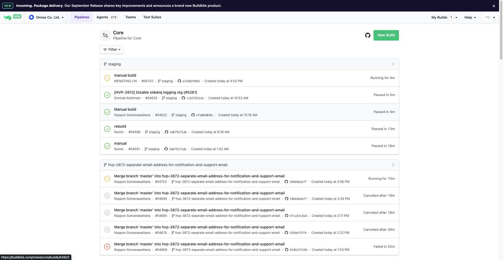

- [1. Omise Core](#1-omise-core)
  - [1.1. API Versioning](#11-api-versioning)
  - [1.2. Opening PRs (pull request) for development](#12-opening-prs-pull-request-for-development)
    - [1.2.1. Code linting (rubocup)](#121-code-linting-rubocup)
    - [1.2.2. Production](#122-production)
    - [1.2.3. Staging](#123-staging)
  - [1.3. User](#13-user)
    - [1.3.1. Merchant ID (MID)](#131-merchant-id-mid)
  - [1.4. Account](#14-account)
  - [1.5. Policies](#15-policies)
  - [1.6. Serializer](#16-serializer)
    - [1.6.1. Custom serializer](#161-custom-serializer)
  - [1.7. Registration](#17-registration)
    - [1.7.1. Issues in MMS](#171-issues-in-mms)
      - [1.7.1.1. N+1 query](#1711-n1-query)
  - [1.8. Errors](#18-errors)
    - [1.8.1. Generic Omise Errors](#181-generic-omise-errors)
  - [1.9. Feature toggle](#19-feature-toggle)
    - [1.9.1. PSP feature flag](#191-psp-feature-flag)
  - [1.10. Elastic Search](#110-elastic-search)
    - [1.10.1. Import records to elasticsearch](#1101-import-records-to-elasticsearch)
  - [1.11. Controllers](#111-controllers)
  - [1.12. Tips for development (local)](#112-tips-for-development-local)
  - [1.13. Unit test, integration test, and specs](#113-unit-test-integration-test-and-specs)
  - [1.14. Deployment](#114-deployment)
    - [1.14.1. Staging](#1141-staging)
- [2. MMS (PAYFAC)](#2-mms-payfac)
  - [2.1. Prerequisite](#21-prerequisite)
  - [2.2. Confluence](#22-confluence)
- [3. Ruby and Ruby on Rails](#3-ruby-and-ruby-on-rails)
  - [3.1. Ruby](#31-ruby)
    - [3.1.1. Array](#311-array)
    - [3.1.2. Lambda function](#312-lambda-function)
      - [3.1.2.1. ActiveRecord scopes](#3121-activerecord-scopes)
      - [3.1.2.2. Lambda vs Proc](#3122-lambda-vs-proc)
      - [3.1.2.3. Lambda use cases](#3123-lambda-use-cases)
    - [3.1.3. Ruby core](#313-ruby-core)
    - [3.1.4. Ruby method](#314-ruby-method)
      - [3.1.4.1. Method arguments](#3141-method-arguments)
    - [3.1.5. Include vs Extend module](#315-include-vs-extend-module)
    - [3.1.6. Class attribute, property, getter, and setter](#316-class-attribute-property-getter-and-setter)
    - [3.1.7. Memoization](#317-memoization)
  - [3.2. Ruby on Rails](#32-ruby-on-rails)
    - [3.2.1. Good testing, test suites, and specs](#321-good-testing-test-suites-and-specs)
    - [3.2.2. Best practices](#322-best-practices)
      - [3.2.2.1. Fat Model, Skinny Controller](#3221-fat-model-skinny-controller)
      - [3.2.2.2. Eager Loading](#3222-eager-loading)
      - [3.2.2.3. Model vs Database validation](#3223-model-vs-database-validation)
      - [3.2.2.4. Prevent SQL injection](#3224-prevent-sql-injection)
      - [3.2.2.5. Enums](#3225-enums)
      - [3.2.2.6. Use Time.current instead of Time.now](#3226-use-timecurrent-instead-of-timenow)
      - [3.2.2.7. Concerns, Services and Helpers](#3227-concerns-services-and-helpers)
        - [3.2.2.7.1. Concerns](#32271-concerns)
        - [3.2.2.7.2. Services](#32272-services)
        - [3.2.2.7.3. Helpers](#32273-helpers)
      - [3.2.2.8. Helpful Gems](#3228-helpful-gems)
    - [3.2.3. App convention](#323-app-convention)
      - [3.2.3.1. Auto loading](#3231-auto-loading)
    - [3.2.4. View](#324-view)
    - [3.2.5. Router](#325-router)
    - [3.2.6. Controller](#326-controller)
      - [3.2.6.1. Conventions](#3261-conventions)
    - [3.2.7. Model](#327-model)
      - [3.2.7.1. Database migration](#3271-database-migration)
      - [3.2.7.2. Create new entity](#3272-create-new-entity)
        - [3.2.7.2.1. Using a form_builder](#32721-using-a-form_builder)
        - [3.2.7.2.2. Using strong parameters](#32722-using-strong-parameters)
        - [3.2.7.2.3. Validations and displaying error message](#32723-validations-and-displaying-error-message)
      - [3.2.7.3. Update an entity](#3273-update-an-entity)
      - [3.2.7.4. Model with reference](#3274-model-with-reference)
    - [3.2.8. Concerns](#328-concerns)
    - [3.2.9. Active Record (ORM)](#329-active-record-orm)
      - [3.2.9.1. Convention over configuration](#3291-convention-over-configuration)
      - [3.2.9.2. Creating Active Record Models](#3292-creating-active-record-models)
      - [3.2.9.3. Overriding the Naming Convention](#3293-overriding-the-naming-convention)
      - [3.2.9.4. CRUD: Reading and Writing Data](#3294-crud-reading-and-writing-data)
        - [3.2.9.4.1. Create data](#32941-create-data)
        - [3.2.9.4.2. Read data](#32942-read-data)
        - [3.2.9.4.3. Update data](#32943-update-data)
        - [3.2.9.4.4. Delete data](#32944-delete-data)
      - [3.2.9.5. Validations](#3295-validations)
      - [3.2.9.6. Callbacks](#3296-callbacks)
      - [3.2.9.7. Migrations](#3297-migrations)
      - [3.2.9.8. Associations](#3298-associations)
      - [3.2.9.9. Active Record Query Interface](#3299-active-record-query-interface)
        - [3.2.9.9.1. Active record code example](#32991-active-record-code-example)
        - [3.2.9.9.2. Retrieving objects from database](#32992-retrieving-objects-from-database)
          - [3.2.9.9.2.1. find method](#329921-find-method)
          - [3.2.9.9.2.2. take method](#329922-take-method)
          - [3.2.9.9.2.3. first method](#329923-first-method)
          - [3.2.9.9.2.4. last method](#329924-last-method)
          - [3.2.9.9.2.5. find_by method](#329925-find_by-method)
        - [3.2.9.9.3. Retrieving multiple objects in batches](#32993-retrieving-multiple-objects-in-batches)
          - [3.2.9.9.3.1. find_each method](#329931-find_each-method)
          - [3.2.9.9.3.2. find_in_batches](#329932-find_in_batches)
        - [3.2.9.9.4. Query conditions](#32994-query-conditions)
          - [3.2.9.9.4.1. Pure string conditions](#329941-pure-string-conditions)
          - [3.2.9.9.4.2. Array conditions](#329942-array-conditions)
          - [3.2.9.9.4.3. Hash conditions](#329943-hash-conditions)
        - [3.2.9.9.5. Ordering](#32995-ordering)
        - [3.2.9.9.6. Selecting specific fields](#32996-selecting-specific-fields)
        - [3.2.9.9.7. Limit and offset](#32997-limit-and-offset)
        - [3.2.9.9.8. Grouping](#32998-grouping)
          - [3.2.9.9.8.1. Total grouped items](#329981-total-grouped-items)
          - [3.2.9.9.8.2. HAVING conditions](#329982-having-conditions)
        - [3.2.9.9.9. Scopes](#32999-scopes)
      - [3.2.9.10. Pluck](#32910-pluck)
    - [3.2.10. Active Model](#3210-active-model)
    - [3.2.11. Meta programming](#3211-meta-programming)
      - [3.2.11.1. Instance variable set](#32111-instance-variable-set)

# 1. Omise Core

## 1.1. API Versioning

1. Naming convention is following alphabetic moons.
2. [https://opn-ooo.atlassian.net/wiki/spaces/EN/pages/579733167/API+versioning](https://opn-ooo.atlassian.net/wiki/spaces/EN/pages/579733167/API+versioning)

## 1.2. Opening PRs (pull request) for development

### 1.2.1. Code linting (rubocup)

1. `rubocop` is a ruby linter and applied in the CI pipeline.

```shell
rubocop -a
```

### 1.2.2. Production

1. Require marking with `category:[level]` and `docs:ok` label for the PR to pass `policy-bot: master`.

### 1.2.3. Staging

1. Development are mostly building on top and branch from `master` branch.
2. When creating a PR for `staging`, branch out from latest staging and merge latest `HEAD` from `master`.
3. Cherry pick commits of works on `master` branch.
4. Push the branch and open PR against `staging`.

```shell
# branch from staging
git checkout -b your-branch-staging
# get latest header from master branch
git merge -s ours master
git merge -s ours origin/master
# cherry-pick commits from development on master branch
git cherry-pick A^..B
```

## 1.3. User

### 1.3.1. Merchant ID (MID)

1. Merchant ID is an unique identifier to differentiate different merchants to proceed transactions to card issuing backends (e.g. `visa` and `master`).
2. Each backend accepts strings as UID while some of them accept only integers in string.
3. In Dashboard V1, `MID` can be set with enabled PSP admin (e.g. Thailand PSP admin) at `user` -> `credentials`.
4. MID setup by Q4 2023 is auto-populated with `user.id` (db integer index) and the further merchants are using `account.id` because MMS system.
   1. In regular cases, each user (account) has its own setup for credentials.
   2. In the same MMS hierarchy, master and sub-merchants are using the exact same `user.id` as they are all under the same entity.
   3. Each sub-merchant has unique `account` scope that can be UID for such case.
5. Related files
   1. `app/controllers/credentials_controller.rb`
   2. `app/views/admin/credentials/new.html.rb`
   3. `app/views/admin/credentials/_form.html.rb`

## 1.4. Account

1. An `account` works as a mixin and includes with various properties and entities and defined at `/app/models/account.rb`
2. `account.closure_node` is related to `sub_merchants`.
3. The account is given in the authentication layer and assigned as an inherited variable `@account` that can be used in all the child classes.
4. `app/controllers/concerns/authenticable.rb`

## 1.5. Policies

1. A team can invited the other user (account) to join as different role (e.g. `admin` and `technical manager`)
2. `policies` method can be applied to allow private endpoint to work as the invited team.
3. Besides adding `policies`, we need to add/update the route in `app/models/team_membership.rb` and its test

```ruby
# allow invited role as admin and technical manager to work on index method
class SomeController
  policies do
    allow :index, only: ["membership.admin", "membership.technical"]
  end

  def index
    # some action
  end
end
```

## 1.6. Serializer

### 1.6.1. Custom serializer

1. Update `app/routes.rb`

```ruby
OmiseCore::Application.routes.draw do
  namespace :api, path: nil, defaults: { format: :json }, constraints: { subdomain: /^api(-\w+)*$/ } do
    resources :some_entities, only: %i[index show] do
    end
  end
end
```

2. Assign serializer in controller

```ruby
class SomeEntityController < API::BaseController
  def index
    some_data = SomeEntity.all

    render json: serialize(some_data,
      as: :some_entity_list_serializer,
      to: :json,
      location: api_some_entities_path)
  end
end
```

3. Register new serializer in `config/initializer/api_version.rb`.

```ruby
# new serializer/service may be register in new version(s) of API
Omise::API.versions.root "Aegaeon", "2014-07-27" do
  define :account,            serializer: true, service: true
  define :charge,             serializer: true, service: true
end
```

4. Create new custom serializer
   1. Named with API versioning (e.g. `Aegaeon`).
   2. Serializers are inherited from `Omise::API::Serializer` (`lib/omise/api/serializer.rb`).
   3. `initialize` with `Omise::API::Schema::Helpers.instance_variable_set` (`lib/omise/api/schema.rb`)
   4. `scoped_list` method is required and has instance variable named by serializer. (e.g. `@some_entity_list`)

```ruby
class SomeEntityListSerializer < Omise::API::Serializer
  def scoped_list
    #dynamic naming from instance_variable_set
    @some_entity_list
  end
end
```

## 1.7. Registration

1. When a team submits to enable `live` account, it starts a `registration` process.
2. `sidekiq` must be running to make full process of the `registration` service.
3. If not, the submitted `registration` may not be listed in `admin` mode of a PSP.
4. The other workaround is to visit `/admin/ekycs/:registration_uid`. The `registration_uid` can be found in `updated_registrations` table.
5. A `Team` may have multiple registrations, each of which can be denied or verified.
6. The relationship is associated in `Team` model and setup with `models/concerns/has_many_registrations.rb`.

### 1.7.1. Issues in MMS

#### 1.7.1.1. N+1 query

1. In MMS,

## 1.8. Errors

### 1.8.1. Generic Omise Errors

1. `lib/omise/api/errors.rb`
2. Error details for response [https://docs.opn.ooo/api-errors](https://docs.opn.ooo/api-errors)

```ruby
class SomeController
  def method
    Omise::API::Errors::[ErrorType], 'error message', if is_error
  end
end
```

```json
// 403 forbidden response
{
  "object": "error",
  "location": "https://www.omise.co/api-errors#not-authorized",
  "code": "not_authorized",
  "message": "error message"
}
```

## 1.9. Feature toggle

### 1.9.1. PSP feature flag

1. [https://opn-ooo.atlassian.net/wiki/spaces/HVPS/pages/588906884/PSP+Level+Feature+Flags](https://opn-ooo.atlassian.net/wiki/spaces/HVPS/pages/588906884/PSP+Level+Feature+Flags)

## 1.10. Elastic Search

### 1.10.1. Import records to elasticsearch

1. `elasticsearch` can run with `brew services` or `docker` on MacOS machines.
2. Some controllers and services in `core` uses `Flubber` search is applying `elasticsearch` under the hood.
3. When main DB (postgres) changes, we may need to run indexer to sync and import the records between 2 databases (`elasticsearch` and `postgres`).
4. The commands can be found in `lib/tasks/elasticsearch.rake`.

```shell
# re-index and import records for team
bin/bundle exec rake environment elasticsearch:import:teams
```

## 1.11. Controllers

1. `admin` controllers may have `policies` to indicate whether certain route is enabled with specific policy assigned to the user with a `membership`.
2. It works with `authorized?` method from `lib/omise/policy.rb`.

---

## 1.12. Tips for development (local)

1. When developing locally, we can comment out `config/initializers/postgres_patches.rb` to show exact line of execution from the code in ruby console.
2. Some VS Code extensions are helpful for coding with intellisense and code snippets and redirect in between context and related files.
   1. Some extensions are invalid for the latest ver. as the project is using older ruby ver.
   2. To use older ver. of extensions,
   3. [Rails](https://marketplace.visualstudio.com/items?itemName=bung87.rails)
   4. [Ruby on Rails](https://marketplace.visualstudio.com/items?itemName=hridoy.rails-snippets)
   5. [Ruby Solargraph](https://marketplace.visualstudio.com/items?itemName=castwide.solargraph)
   6. [VSCode Ruby](https://marketplace.visualstudio.com/items?itemName=wingrunr21.vscode-ruby)

## 1.13. Unit test, integration test, and specs

1. `test/test_helper.rb` provides some useful testing methods.
2. When setting up `context` for a controller/service instance, we can use `@context = Omise::API::Context.from_account(@account)`.
3. The `account`, `user` or other entities can be referred from list of fixtures in `test/fixtures`.

   1. Each fixtures is kept as `[entities].yml` which can be referred with method `entities(:specific_entity)`.
   2. e.g. Call `accounts(:max_live_account_with_mca)` to get a `live` account.
   3. `teams(:max)` to get team of Max.

   ```ruby
   # unit test SubMerchantSerializer
   require "test_helper"

   class Aegaeon::SubMerchantSerializerTest < ActiveSupport::TestCase
     def setup
       @team = teams(:robins_submerchant_team)
       @sub_merchant = SubMerchant.last
       @context = Omise::API::Context.from_account(accounts(:robin_test))
       @sub_merchant_serializer = Aegaeon::SubMerchantSerializer.new(@context, @sub_merchant)
     end
   end
   ```

4. To ensure mock data is coming from an associated entity, we can refer to other relationship of the entities when setup mocks.

   1. Get an account from `max_live_account_with_mca`
   2. Retrieve the master node as the top of MMS tree
   3. Use `self_and_descendants` method to traverse and collect all the child nodes of the master
   4. Use `pluck` to retrieve and create an array of IDs of the `resource`, which is `Team` in this case.

   ```ruby
   require "test_helper"

   class Aegaeon::SubMerchantListSerializerTest < ActiveSupport::TestCase
     def setup
       @account = accounts(:max_live_account_with_mca)
       @master_node = @account.closure_node
       sub_team_ids = @master_node.self_and_descendants.pluck(:resource_id)

       @sub_merchant_list = SubMerchant.where(id: sub_team_ids)
       @context = Omise::API::Context.from_account(@account)
       @sub_merchant_list_serializer = Aegaeon::SubMerchantListSerializer.new(@context, @sub_merchant_list)
     end
   end
   ```

## 1.14. Deployment

### 1.14.1. Staging

1. The current CI pipeline doesn't trigger image build by Q4 2023.
2. After merge a commit to `staging` branch, the build process needs to be triggered manually.
3. The current CI pipeline uses [`buildkite`](https://buildkite.com/omise/core).




# 2. MMS (PAYFAC)

## 2.1. Prerequisite

1. A `User` can have an only, single owned `Team`, while can be "**invited**" to work at other `Team` for certain `role` through `Membership` and `TeamMembership` model.
2. A `Team` have 2 types of accounts
   1. `test` for testing and staging environment which DOES NOT work with real balance and transaction services. This type of account is set to be created when creating a new `Team`.
   2. `live` for real and production environment and touches real money. A `live` account must go through `kyc` process by submitting required documents and accepted by system admin.
3. A `SubMerchant` is a `Team` with `parent_team_id` and can be associated in a tree hierarchy structure through `closure_nodes` and `closure_node_hierarchies`.
   1. `SubMerchant` is inherited from `Team` and use the same table in DB.
   2. The only difference between 2 models is that `SubMerchant` must have a `parent_team_id` to belong to, while `Team` does not.
4. Current hierarchy allows sub-merchants up to `7`-level.

## 2.2. Confluence

[https://opn-ooo.atlassian.net/wiki/spaces/PayFac/pages/857539575/PAYFAC+Documentation](https://opn-ooo.atlassian.net/wiki/spaces/PayFac/pages/857539575/PAYFAC+Documentation)

# 3. Ruby and Ruby on Rails

## 3.1. Ruby

### 3.1.1. Array

1. `<<` can be used to append a single item to an array.
2. To add multiple items once, we can use `Array#push` method instead.
3. `Array#push` method is useful when receiving multiple arguments, but will push the argument directly if it's an array.
4. To append all items individually into another array, we can use `Array#concat` instead.
5. The other workaround is to use `Array#each` method and append items from the code block.

```ruby
# append item to a ruby array
array = [1,2,3]
array << 4
# [1,2,3,4]

array.push 5
# [1,2,3,4,5]

array.concat [6]
# [1,2,3,4,5,6]

source_array = [7]
array.each { |n| array << n }
# [1,2,3,4,5,6,7]
```

### 3.1.2. Lambda function

1. Lambda function are considered anonymous functions which can be kept in a variable and passed as an argument.
2. A lambda function must be called with `Lambda#call` method or the other syntax. It doesn't work directly as regular ruby functions.
3. Lambda functions can also accept argument(s).
4. To declare a lambda function, we can use either `lambda` keyword or `->` (dash rocket) symbol.

```ruby
# lambda without argument
my_lambda = -> { puts "hello" }
my_lambda = lambda { puts "hello" }

# syntax calling lambda
my_lambda.call
my_lambda.()
my_lambda.[]
my_lambda.===

# lambda accepting argument
my_lambda_with_args = -> (v) { puts "hello "+v }

# lambda works as passed in arguments
double_it = lambda { |num| num * 2 }
triple_it = lambda { |num| num * 3 }
half_it  = lambda { |num| num / 2 }

value = 5

lambda_pipeline = [double_it, triple_it, half_it]

lambda_pipeline.each do |lmb|
  value = lmb.call(value)
end

puts value
# 5 * 2 * 3 / 2 = 15
```

5. A lambda has an execution context, represented in Ruby by a Binding object. This is the environment in which your code executes, including, among other things, local variables. This means that lambdas can be closures which allow the code in the function to access these captured local variables.

```ruby
# lambda context
def build_lambda
  output = "output from function"
  return lambda { puts output }
end

output = "output from top level"

my_lambda = build_lambda

my_lambda.call
# output from function
```

#### 3.1.2.1. ActiveRecord scopes

1. ActiveRecord scopes, used in Rails applications, are commonplace to see a lambda function.
2. If the value is not evaluated at run time, when the code executes, the function can go very wrong.
3. If this wasn’t a `lambda`, then `1.week.ago` would be evaluated when the class is loaded, rather than when the lambda runs.

```ruby
# lambda in active record in RoR
scope :new_posts, lambda { where("created_at > ?", 1.week.ago) }
```

#### 3.1.2.2. Lambda vs Proc

1. `Lambda`s enforce argument count. A lambda must be called with exactly number of arguments as it declares.
2. `Procs`, on the other hand, accept any number of arguments. If they are passed too few arguments, the unpassed arguments are set to a value of nil. If they are passed too many arguments, the extraneous arguments are dropped silently.
3. However, `lambda`s accept splat operator `*` to receive multiple arguments.
4. The behavior of `return` statement is different
   1. The return statement in a `lambda` function stops the lambda and returns control to the calling code.
   2. The return statement in a `Proc`, in contrast, returns from both the Proc and the calling code.

#### 3.1.2.3. Lambda use cases

1. ActiveRecord scopes
   1. As mentioned previously, ActiveRecord scopes are a common use of Ruby lambdas.
2. Callbacks
   1. Lambdas are great choices for simple callbacks.
   2. You can define them right before you use them or inline, without the cognitive overhead of an object or the namespace pollution of a function.
   3. In the Rails codebase, lambdas are used to capture success or failures in tests.
3. Dynamic mapping
   1. If you want to map over a collection, but the map function changes based on the input, you can use a lambda to encapsulate the changing logic.
4. Faux hash
   1. Because a lambda can be called with the syntax: `my_lambda["argument"]`, you can create a hash-like read-only object which returns values from a key based on code.

```ruby
# lambda faux hash
def build_lambda(restricted_values)
  my_hash = {}

  my_lambda = lambda do |key|
    if restricted_values.include? key
      return "n/a"
    else
      return key + key
    end
  end

  my_lambda
end

my_multiplying_hash_like_object = build_lambda(['hi'])

puts my_multiplying_hash_like_object["hi"]
# n/a
puts my_multiplying_hash_like_object["bye"]
# byebye
```

### 3.1.3. Ruby core

1. `Comparable` module can be included in a class to make its instances comparable.

### 3.1.4. Ruby method

1. `return` keyword can only be used in a ruby method.

#### 3.1.4.1. Method arguments

1. [https://www.rubyguides.com/2018/06/rubys-method-arguments/](https://www.rubyguides.com/2018/06/rubys-method-arguments/)
2. Function/method arguments can be named and become mandatory and shiftable.
3. Single asterisk `*` turns multiple arguments into an array.
4. Double asterisk `**` suggests the function/method only accepts hash for the argument and keeps it optional.
5. required -> optional -> variable -> keyword

```ruby
def testing(a, b = 1, *c, d: 1, **x)
  p a,b,c,d,x
end

testing('a', 'b', 'c', 'd', 'e', d: 2, x: 1)

# "a"
# "b"
# ["c", "d", "e"]
# 2
# {:x=>1}
```

### 3.1.5. Include vs Extend module

1. The difference between `include` and `extend` is that
   1. `include` is for adding methods only to an **instance** of a class and
   2. `extend` is for adding methods to the **class** but not to its instance.
2. [https://www.geeksforgeeks.org/include-v-s-extend-in-ruby/](https://www.geeksforgeeks.org/include-v-s-extend-in-ruby/)

```ruby
# Ruby program of Include and Extend

# Creating a module contains a method
module Geek
  def geeks
    puts 'GeeksforGeeks!'
  end
end

class Lord

  # only Lord can access geek methods
  # with the instance of the class.
  include Geek
end

class Star

  # only Lord can access geek methods
  # with the class definition.
  extend Geek
end

# object access
Lord.new.geeks

# class access
Star.geeks

# NoMethodError: undefined  method
# `geeks' for Lord:Class
Lord.geeks
```

### 3.1.6. Class attribute, property, getter, and setter

1. Ruby class has `initialize` method to have custom initializing behavior.
2. To access a property of an object, we need to setup either or both getter and setter for the property.
3. However, setting getters and setters directly is a tedious task.
4. We can use these keywords to help creator helpers `attr_reader`, `attr_writer`, `attr_accessor`

```ruby
class Book
  def initialize(title, author)
    @title = title
    @author = author
  end

  ## Getter methods
  def title
    return @title
  end
  def author
    return @author
  end

  ## Setter methods
  def title=(new_title)
    @title = new_title
  end
  def author=(new_author)
    @author = new_author
  end
end
```

4. In this case, we can use Ruby's `attr` class helper methods.
5. Using `attr_reader`

```ruby
class Book
  attr_reader :title, :author # <-- Getter methods

  def initialize(title, author)
    @title = title
    @author = author
  end

  ## Setter methods
  def title=(new_title)
    @title = new_title
  end
  def author=(new_author)
    @author = new_author
  end
end
```

6. Using `attr_writer`

```ruby
class Book
  attr_reader :title, :author # <-- Getter methods
  attr_writer :title, :author # <-- Setter methods

  def initialize(title, author)
    @title = title
    @author = author
  end

  ## Setter methods
  def title=(new_title)
    @title = new_title
  end
  def author=(new_author)
    @author = new_author
  end
end
```

7. Using `attr_accessor`

```ruby
class Book
  attr_accessor :title, :author # <-- Creates both getter and setter method

  def initialize(title, author)
    @title = title
    @author = author
  end
end
```

### 3.1.7. Memoization

1. Memoization is part of cache technique to return the same output by the same input.
2. This can be helpful in an object instance lifecycle that if the same methods/attributes are used for several times, the value can be memoized without re-running the same heavy/expensive calculation.

```ruby
class Email
  def all_email_count
    @emails =|| begin
      User.all.get_emails
    end

    @emails.count
  end
end
```

## 3.2. Ruby on Rails

### 3.2.1. Good testing, test suites, and specs

1. [https://www.betterspecs.org/](https://www.betterspecs.org/)

### 3.2.2. Best practices

1. References
   1. [https://medium.com/@ishtri51/ruby-on-rails-best-practices-d7692f3c6d4d](https://medium.com/@ishtri51/ruby-on-rails-best-practices-d7692f3c6d4d)

#### 3.2.2.1. Fat Model, Skinny Controller

1. It basically means placing most of the business logic, data manipulation, and validations within the models (fat models) while keeping the controllers focused on handling request/response and routing (skinny controllers).
2. In most cases, variables and logics handling view behavior in controllers can be extracted to `helper` class or `helper_method`.
3. [`helper_method`](https://apidock.com/rails/ActionController/Helpers/ClassMethods/helper_method) allows views to access and use methods in controller without assigning an instance variable.

#### 3.2.2.2. Eager Loading

1. `N+1` Problem is an infamous problem faced by many ORM using frameworks including rails.
2. It arises when an application makes `N` additional queries to the database for a collection of records, where `N` is the number of initial records are retrieved.
3. In Rails, eager loading can be accomplished using the `includes` method or the `preload` method.
4. Note that `includes` and `preload` have slightly different behaviors.
   1. `includes` performs a left outer join to load the associated data, which can help avoid the `N+1` query problem.
   2. On the other hand, `preload` performs separate queries for each association and then associates the data in memory.

#### 3.2.2.3. Model vs Database validation

1. `ActiveRecord` includes [validation](https://guides.rubyonrails.org/active_record_validations.html) features so data offered to the database can be validated before being accepted and persisted.
2. Data-related validation (such as field constraints) should be done in the database.
3. Any validation that is following some business rules (such as email validation) should be done in the model.

#### 3.2.2.4. Prevent SQL injection

1. SQLi (SQL Injection) is a type of security vulnerability that occurs when an application fails to properly sanitize or validate user-supplied input before incorporating it into SQL queries.
2. Use dynamic attribute based finder

```ruby
# Bad Practice
User.where("name = '#{params[:name]}'") # SQL Injection!

# Good Practice
User.find_by_name(name) # dynamic finder
```

#### 3.2.2.5. Enums

1. An `enum` in Rails is a data type that represents a set of named values. The values of an `enum` are stored as integers in the database, but they can be accessed by name in Ruby code. This makes it easier to work with `enum`s in your Rails application.

```ruby
class AddStatusToOrders < ActiveRecord::Migration[6.0]
  def change
    add_column :orders, :status, :integer, default: 0
  end
end

# Model: Order.rb
class Order < ApplicationRecord
  enum status: {
    placed: 0,
    packed: 1,
    shipped: 2,
    delivered: 3
  }
end

# work with status
order = Order.create(status: :placed)

# Check the status of the order
order.status == :placed
# or
order.placed?

# Change the status of the order
order.status = :packed
# or
order.packed!

# Scope
order.shipped # use instead Order.where(status: 'shipped')
```

2. You can use `_prefix` (or `suffix`) in enum definition, so that all the helpers can be prefixed(or suffixed) by the column name.

```ruby
# Model: Order.rb
enum status: {
    placed: 0,
    packed: 1,
    shipped: 2
}, _prefix: true

order.status_placed? # status == 'placed'
order.status_packed! # update(status: :packed)
order.status_shipped # User.where(status: :shipped)
```

#### 3.2.2.6. Use Time.current instead of Time.now

1. keep in mind that `Time.now` returns a Time object representing the current time in the default system time zone. To get the current time in application’s configured time zone you have to use `Time.zone.now`.
2. Unlike `Time.now`, which uses the default system time zone, `Time.current` takes into account the time zone configured for the Rails application.

```ruby
# config/application.rb
config.time_zone = "Africa/Nairobi"

# Fetch current time in default system's zone
current_time = Time.now # 2023-07-13 10:57:05.751843358 +0530

# Fetch current time in application set time zone
current_time = Time.zone.now # Thu, 13 Jul 2023 08:27:07.607994466 EAT +03:00
# or better
current_time = Time.current # Thu, 13 Jul 2023 08:27:10.015227438 EAT +03:00
```

#### 3.2.2.7. Concerns, Services and Helpers

##### 3.2.2.7.1. Concerns

1. In Rails, `Concerns` are modules that encapsulate reusable code and behavior that can be included in multiple classes or modules. It extends `ActiveSupport::Concern` module.
2. They help keep models focused and avoid excessive code duplication. `Concerns` are implemented using Ruby modules and included in classes using the `include` keyword.

```ruby
# app/models/concerns/trashable.rb
module Trashable
  extend ActiveSupport::Concern

  included do
    scope :existing, -> { where(trashed: false) }
    scope :trashed, -> { where(trashed: true) }
  end

  def trash
    update_attribute :trashed, true
  end
end

# Model song.rb
class Song < ApplicationRecord
  include Trashable

  has_many :authors

  # ...
end

# Model album.rb
class Album < ApplicationRecord
  include Trashable

  has_many :authors

  def featured_authors
    authors.where(featured: true)
  end

  # ...
end
```

##### 3.2.2.7.2. Services

1. As your application grows, you may begin to see domain/business logic littered across the models and the controller. Such logics do not belong to either the controller or the model, so they make the code difficult to re-use and maintain.
2. Service objects are plain old Ruby objects (PORO’s) that do one thing .They encapsulate a set of business logic, moving it out of models and controllers and into a more focused setting.

```ruby
# app/services/create_user_service.rb

class CreateUserService
  attr_reader :name, :email, :pass

  def initialize(name, email, pass)
    @name = name
    @email = email
    @pass = pass
  end

  def call
    prev_user = User.find_by email: @email
    raise StandardError, 'User already exists' if prev_user.present?

    User.create(name: @name, email: @email, pass: @pass)
  end
end


# Controller: users_controller.rb

class UserController < ApplicationController
  def create
    begin
      ActiveRecord::Base.transaction do
        # Create User
        user = CreateUserService.new(params[:name], params[:email], params[:pass]).call
        render json: { user: user }
      end
    rescue StandardError => e
      render json: { error: e }
    end
  end
end
```

##### 3.2.2.7.3. Helpers

1. A helper is a method that is used in your Rails **views** to share reusable code. Helper methods are defined within modules called `Helper Module` and are automatically made available to the corresponding views.

```ruby
# app/helpers/users_helper.rb

module UsersHelper
  def full_name(user)
    "#{user.first_name} #{user.last_name}"
  end
end

# View: users/show.html.erb

<h1><%= full_name(@user) %></h1>
```

#### 3.2.2.8. Helpful Gems

- `oj`: Library for both parsing and generating JSON with a ton of options.
- `rack-mini-profiler`: Middleware that provides performance profiling and diagnostics for Rack-based applications.
- `pry`: Debug APIs in real time.
- `rubocop`: Static code analyzer and code formatter enforcing Ruby code style conventions.
- `bullet`: Helps detecting and alerts N+1 database query issues in Rails applications.
- `devise`: A flexible and secure authentication solution for Ruby on Rails.
- `cancancan`: Authorization library that restricts user access based on user roles and permissions.
- `annotate`: Automatically adds schema information as comments to your models and specs.
- `discard`: Soft-delete implementation for ActiveRecord models.
- `sidekiq`: Simple and efficient background job processing for Ruby.
- `friendlyId`: Gem for creating human-readable URLs by using slugs for ActiveRecord models.
- `paperclip`: Gem for handling file attachments in Rails applications.

### 3.2.3. App convention

#### 3.2.3.1. Auto loading

1. Rails applications do not use require to load application code.
2. You only need require calls for two use cases:
   1. To load files under the `lib` directory.
   2. To load gem dependencies that have `require: false` in the Gemfile.

### 3.2.4. View

1. For UIs built from similar code, we can create `partials` to share these UI components in between views.
2. `partials` are named with a prefix with underscore `_`.
3. A partial can be used with keyword `render` in the other view files.

```erb
# app/views/articles/_form.html.erb
<%= form_with model: article do |form| %>
  <div>
    <%= form.label :title %><br>
    <%= form.text_field :title %>
    <% article.errors.full_messages_for(:title).each do |message| %>
      <div><%= message %></div>
    <% end %>
  </div>

  <div>
    <%= form.label :body %><br>
    <%= form.text_area :body %><br>
    <% article.errors.full_messages_for(:body).each do |message| %>
      <div><%= message %></div>
    <% end %>
  </div>

  <div>
    <%= form.submit %>
  </div>
<% end %>
```

4. A partial's filename must be prefixed with an underscore, e.g. `_form.html.erb`. But when rendering, it is referenced without the underscore, e.g. render "`form`".

```erb
# app/views/articles/edit.html.erb
<h1>Edit Article</h1>

<%= render "form", article: @article %>
```

### 3.2.5. Router

1. We can change router default to show content of a specific route.

```ruby
# config/routes.rb
Rails.application.routes.draw do
  root "articles#index"

  get "/articles", to: "articles#index"
end
```

2. Though we may create different API endpoints to `CRUD` resources, it can be very tedious to work on each of them with `RESTful` pattern.
3. We can use `resources` keyword in router which creates several endpoints by following RESTful styles to implement `CRUD`.

```bash
# list all routes
bin/rails routes

# table of routes
      Prefix Verb   URI Pattern                  Controller#Action
        root GET    /                            articles#index
    articles GET    /articles(.:format)          articles#index
 new_article GET    /articles/new(.:format)      articles#new
     article GET    /articles/:id(.:format)      articles#show
             POST   /articles(.:format)          articles#create
edit_article GET    /articles/:id/edit(.:format) articles#edit
             PATCH  /articles/:id(.:format)      articles#update
             DELETE /articles/:id(.:format)      articles#destroy
```

4. Besides, `resources` method also set up URL and path helper methods that we can use to keep the code from depending on a specific route configuration.
5. The values in the "`Prefix`" column above plus a suffix of `_url` or `_path` form the names of these helpers.
6. For example, the `article_path` helper returns "`/articles/#{article.id}`" when given an article.
7. In view file, we can use the helper function to generate links for anchor tag `<a>`.

```erb
<!-- app/views/articles/index.html.erb -->

<h1>Articles</h1>

<ul>
  <% @articles.each do |article| %>
    <li>
      <a href="<%= article_path(article) %>">
        <%= article.title %>
      </a>
    </li>
  <% end %>
</ul>
```

8. On the other hand, we can use `link_to` shorthand in `erb` file to generate a link.
9. The `link_to` helper renders a link with its 1st argument as the link's text and its 2nd argument as the link's destination.
10. If we pass a model object as the 2nd argument, link_to will call the appropriate path helper to convert the object to a path.

```erb
<!-- app/views/articles/index.html.erb -->

<h1>Articles</h1>

<ul>
  <% @articles.each do |article| %>
    <li>
      <%= link_to article.title, article %>
    </li>
  <% end %>
</ul>
```

### 3.2.6. Controller

1. Generating `controller`

```bash
bin/rails generate controller Articles index --skip-routes

# created along with article_controller.rb
create  app/controllers/articles_controller.rb
invoke  erb
create    app/views/articles
create    app/views/articles/index.html.erb
invoke  test_unit
create    test/controllers/articles_controller_test.rb
invoke  helper
create    app/helpers/articles_helper.rb
invoke    test_unit
```

#### 3.2.6.1. Conventions

1. When an action (method) of a controller class is empty, rails will automatically render a view that matches the name of the controller.
2. In the following class, the `index` method will try to render `app/views/articles/index.html.erb` by default.

```ruby
# config/routes.rb
Rails.application.routes.draw do
  get "/articles", to: "articles#index"
end

# articles_controller.rb
class ArticlesController < ApplicationController
  def index
  end
end
```

### 3.2.7. Model

1. A `model` is a Ruby class that is used to represent data.
2. Additionally, models can interact with the application's database through a feature of Rails called `Active Record`.
3. When generating a `model`, several other files are created.

```bash
bin/rails generate model Article title:string body:text

# created along with models/article.rb
invoke  active_record
create    db/migrate/<timestamp>_create_articles.rb
create    app/models/article.rb
invoke    test_unit
create      test/models/article_test.rb
create      test/fixtures/articles.yml
```

#### 3.2.7.1. Database migration

1. Migrations are used to alter the structure of an application's database.
2. In Rails applications, migrations are written in Ruby so that they can be database-agnostic.

```ruby
# migration file after creating a new model
# db/migrate/<timestamp>_create_articles.rb
class CreateArticles < ActiveRecord::Migration[7.1]
  def change
    create_table :articles do |t|
      t.string :title
      t.text :body

      t.timestamps
    end
  end
end
```

3. By having the migration file, we can run `bin/rails db:migrate` to update database schema.
4. After migrating changes to database, we can run `bin/rails console` to work on `irb` and work with database with the models we created.
5. We can use some generic model methods such as `Model#find` and `Model#all`.
6. Note that `Model#all` returns an `ActiveRecord::Relation` object which is an array of entities with some other useful methods.

#### 3.2.7.2. Create new entity

##### 3.2.7.2.1. Using a form_builder

1. In controller, we may have a `new` and `create` method to create a new entity.
   1. `new` for user to request and fill a form to create an entity.
   2. `create` is the endpoint to be called to create an entity with the data from the `new` form.
2. `redirect_to` will cause the browser to make a new request, whereas render renders the specified view for the current request.
3. It is important to use `redirect_to` after mutating the database or application state.
4. Otherwise, if the user refreshes the page, the browser will make the same request, and the mutation will be repeated.

```ruby
# app/controllers/articles_controller.rb
class ArticlesController < ApplicationController
  def index
    @articles = Article.all
  end

  def show
    @article = Article.find(params[:id])
  end

  def new
    @article = Article.new
  end

  def create
    @article = Article.new(title: "...", body: "...")

    if @article.save
      # redirect to make a new request and
      # prevent the same mutation
      redirect_to @article
    else
      render :new, status: :unprocessable_entity
    end
  end
end
```

5. To generate a form for `new` method to collect value to create a new entity, we can use `form builder`.
6. The `form_with` helper method instantiates a form builder.

```erb
# app/views/articles/new.html.erb
<h1>New Article</h1>

<%= form_with model: @article do |form| %>
  <div>
    <%= form.label :title %><br>
    <%= form.text_field :title %>
  </div>

  <div>
    <%= form.label :body %><br>
    <%= form.text_area :body %>
  </div>

  <div>
    <%= form.submit %>
  </div>
<% end %>
```

##### 3.2.7.2.2. Using strong parameters

7. Submitted form data is put into the `params` Hash, alongside captured route parameters.
8. Thus, the create action can access the submitted title via `params[:article][:title]` and the submitted body via `params[:article][:body]`.
9. Though we can pass a single Hash that contains the values, we must still specify what values are allowed in that Hash.
10. Otherwise, a malicious user could potentially submit extra form fields and overwrite private data.
11. In such cases, we can create a new private method `article_params` in the controller.

```ruby
# app/controllers/articles_controller.rb
class ArticlesController < ApplicationController
  def index
    @articles = Article.all
  end

  def show
    @article = Article.find(params[:id])
  end

  def new
    @article = Article.new
  end

  def create
    @article = Article.new(article_params)

    if @article.save
      redirect_to @article
    else
      render :new, status: :unprocessable_entity
    end
  end

  private
    # strong parameters
    def article_params
      params.require(:article).permit(:title, :body)
    end
end
```

##### 3.2.7.2.3. Validations and displaying error message

1. Besides setting up process for creating an entity on `view` and `controller`, we can set validation process on `model`.
2. Validations are rules that are checked before a model object is saved.
3. If any of the checks fail, the save will be aborted, and appropriate error messages will be added to the errors attribute of the model object.
4. `ActiveRecord` automatically defines model attributes for every table column, so you don't have to declare those attributes in your model file.

```ruby
# app/models/article.rb
# ActiveRecord defines models attribute and includes all column from the table
class Article < ApplicationRecord
  validates :title, presence: true
  validates :body, presence: true, length: { minimum: 10 }
end
```

1. Thus in the collecting form `new.html.erb` with `ArticlesController#new` method, we can refer the error form the model object.
2. The `full_messages_for` method returns an array of user-friendly error messages for a specified attribute. If there are no errors for that attribute, the array will be empty.

```erb
# app/views/articles/new.html.erb
<h1>New Article</h1>

<%= form_with model: @article do |form| %>
  <div>
    <%= form.label :title %><br>
    <%= form.text_field :title %>
    <% @article.errors.full_messages_for(:title).each do |message| %>
      <div><%= message %></div>
    <% end %>
  </div>

  <div>
    <%= form.label :body %><br>
    <%= form.text_area :body %><br>
    <% @article.errors.full_messages_for(:body).each do |message| %>
      <div><%= message %></div>
    <% end %>
  </div>

  <div>
    <%= form.submit %>
  </div>
<% end %>
```

#### 3.2.7.3. Update an entity

1. The implementation to edit/update an existing entity is quite similar to create a new one.
2. From the previous example, we can have 2 more methods `edit` and `update` in `ArticlesController`.

```ruby
# app/controllers/articles_controller.rb
class ArticlesController < ApplicationController
  def index
    @articles = Article.all
  end

  def show
    @article = Article.find(params[:id])
  end

  def new
    @article = Article.new
  end

  def create
    @article = Article.new(article_params)

    if @article.save
      redirect_to @article
    else
      render :new, status: :unprocessable_entity
    end
  end

  def edit
    @article = Article.find(params[:id])
  end

  def update
    @article = Article.find(params[:id])

    if @article.update(article_params)
      redirect_to @article
    else
      render :edit, status: :unprocessable_entity
    end
  end

  private
    def article_params
      params.require(:article).permit(:title, :body)
    end
end
```

#### 3.2.7.4. Model with reference

1. After creating `Article` entity, we can have `Comment` which belongs to each article.

```bash
bin/rails generate model Comment commenter:string body:text article:references
```

2. By giving references, `Comment` will have an attribute `belongs_to`.
3. The `:references` keyword used in the shell command is a special data type for models.
4. It creates a new column on your database table with the provided model name appended with an `_id` that can hold integer values.
5. In this case, we set up an one to many relationship. That is an `Article` may have one or more `Comment`s.

```ruby
# app/models/comment.rb
class Comment < ApplicationRecord
  belongs_to :article
end

# app/models/article.rb
class Article < ApplicationRecord
  has_many :comments

  validates :title, presence: true
  validates :body, presence: true, length: { minimum: 10 }
end
```

6. For the API routes, since `Comment` must be attached to an `Article`.
7. This creates `Comment`s as a nested resource within `Article`s. This is another part of capturing the hierarchical relationship that exists between `Article`s and `Comment`s.

```ruby
# config/routes.rb
Rails.application.routes.draw do
  root "articles#index"

  resources :articles do
    resources :comments
  end
end
```

8. To allow users adding `Comment` to an `Article`, we can update `app/views/articles/show.html.erb`.
9. This adds a form on the `Article` show page that creates a new comment by calling the `CommentsController` `create` action.
10. The `form_with` call here uses an array, which will build a nested route, such as `/articles/1/comments`.

```erb
# app/views/articles/show.html.erb
<h1><%= @article.title %></h1>

<p><%= @article.body %></p>

<ul>
  <li><%= link_to "Edit", edit_article_path(@article) %></li>
  <li><%= link_to "Destroy", article_path(@article), data: {
                    turbo_method: :delete,
                    turbo_confirm: "Are you sure?"
                  } %></li>
</ul>

<h2>Add a comment:</h2>
<%= form_with model: [ @article, @article.comments.build ] do |form| %>
  <p>
    <%= form.label :commenter %><br>
    <%= form.text_field :commenter %>
  </p>
  <p>
    <%= form.label :body %><br>
    <%= form.text_area :body %>
  </p>
  <p>
    <%= form.submit %>
  </p>
<% end %>
```

### 3.2.8. Concerns

1. A `concern` is a module that you extract to split the implementation of a class or module in coherent chunks, instead of having one big class body. The API surface is the same one, they just help organize the code
2. [https://www.akshaykhot.com/how-rails-concerns-work-and-how-to-use-them/](https://www.akshaykhot.com/how-rails-concerns-work-and-how-to-use-them/)

### 3.2.9. Active Record (ORM)

#### 3.2.9.1. Convention over configuration

1. When using class names composed of two or more words, the model class name should follow the Ruby conventions, using the `CamelCase` form, while the table name must use the `snake_case` form.
   1. Model Class - Singular with the first letter of each word capitalized (e.g., `BookClub`).
   2. Database Table - Plural with underscores separating words (e.g., `book_clubs`).
2. Foreign keys - These fields should be named following the pattern `singularized_table_name_id`.
3. Primary keys - By default, Active Record will use an integer column named `id` as the table's primary key.
   1. When using Active Record Migrations to create the tables, this column will be automatically created.
4. Active Record has some reserved column names
   1. `created_at`
   2. `updated_at`
   3. `lock_version`
   4. `type`
   5. `(association_name)_type`
   6. `(table_name)_count`

#### 3.2.9.2. Creating Active Record Models

1. To create Active Record models, subclass `ApplicationRecord`.
2. This will create a `Product` model, mapped to a `products` table at the database.

   ```ruby
   class Product < ApplicationRecord
   end
   ```

3. By doing this you'll also have the ability to map the columns of each row in that table with the attributes of the instances of your model.

   ```sql
   CREATE TABLE products (
     id int(11) NOT NULL auto_increment,
     name varchar(255),
     PRIMARY KEY  (id)
   );
   ```

#### 3.2.9.3. Overriding the Naming Convention

1. Since `ApplicationRecord` inherits from `ActiveRecord::Base`, your application's models will have a number of helpful methods available to them.
2. For example, you can use the `ActiveRecord::Base.table_name=` method to customize the table name that should be used.

   ```ruby
   class Product < ApplicationRecord
     self.table_name = "my_products"
   end
   ```

3. If you do so, you will have to manually define the class name that is hosting the fixtures (`my_products.yml`) using the `set_fixture_class` method in your test definition.

   ```ruby
   # test/models/product_test.rb
   class ProductTest < ActiveSupport::TestCase
     set_fixture_class my_products: Product
     fixtures :my_products
     # ...
   end
   ```

4. It's also possible to override the column that should be used as the table's primary key using the `ActiveRecord::Base.primary_key=` method.

   ```ruby
   class Product < ApplicationRecord
     self.primary_key = "product_id"
   end
   ```

#### 3.2.9.4. CRUD: Reading and Writing Data

##### 3.2.9.4.1. Create data

1. Active Record objects can be created from a hash, a block, or have their attributes manually set after creation. The `new` method will return a new object while `create` will return the object and save it to the database.
2. A call to `user.save` will commit the record to the database.
3. If a block is provided, both `create` and `new` will yield the new object to that block for initialization, while only `create` will persist the resulting object to the database.

   ```ruby
   # create with arguments
   user = User.create(name: "David", occupation: "Code Artist")

   # create blank and assign arguments
   user = User.new
   user.name = "David"
   user.occupation = "Code Artist"

   # create with code block
   user = User.new do |u|
     u.name = "David"
     u.occupation = "Code Artist"
   end
   ```

##### 3.2.9.4.2. Read data

1. More in [Active Record Query Interface](#2289-active-record-query-interface)

```ruby
# return a collection with all users
users = User.all

# return the first user
user = User.first

# return the first user named David
david = User.find_by(name: 'David')

# find all users named David who are Code Artists and sort by created_at in reverse chronological order
users = User.where(name: 'David', occupation: 'Code Artist').order(created_at: :desc)
```

##### 3.2.9.4.3. Update data

```ruby
user = User.find_by(name: 'David')
user.name = 'Dave'
user.save

user = User.find_by(name: 'David')
user.update(name: 'Dave')

User.update_all max_login_attempts: 3, must_change_password: true
```

##### 3.2.9.4.4. Delete data

```ruby
user = User.find_by(name: 'David')
user.destroy

# find and delete all users named David
User.destroy_by(name: 'David')

# delete all users
User.destroy_all
```

#### 3.2.9.5. Validations

1. Methods like `save`, `create` and `update` validate a model before persisting it to the database.
2. When a model is invalid these methods return `false` and no database operations are performed.
3. All of these methods have a bang counterpart (that is, `save!`, `create!` and `update!`), which are stricter in that they raise an `ActiveRecord::RecordInvalid` exception when validation fails.

```ruby
class User < ApplicationRecord
  validates :name, presence: true
end

user = User.new
user.save
user.save!
# ActiveRecord::RecordInvalid: Validation failed: Name can't be blank
```

#### 3.2.9.6. Callbacks

1. Active Record callbacks allow you to attach code to certain events in the life-cycle of your models.
2. This enables you to add behavior to your models by transparently executing code when those events occur, like when you create a new record, update it, destroy it, and so on.

```ruby
class User < ApplicationRecord
  after_create :log_new_user

  private
    def log_new_user
      puts "A new user was registered"
    end
end

@user = User.create
# A new user was registered
```

#### 3.2.9.7. Migrations

1. Rails provides a convenient way to manage changes to a database schema via migrations.
2. Migrations are written in a domain-specific language and stored in files which are executed against any database that Active Record supports.
3. Note that the code below is database-agnostic: it will run in `MySQL`, `PostgreSQL`, `SQLite`, and others.
4. Rails keeps track of which migrations have been committed to the database and stores them in a neighboring table in that same database called `schema_migrations`.
5. To run the migration and create the table, you'd run `bin/rails db:migrate`, and to roll it back and delete the table, `bin/rails db:rollback`.

```ruby
class CreatePublications < ActiveRecord::Migration[7.1]
  def change
    create_table :publications do |t|
      t.string :title
      t.text :description
      t.references :publication_type
      t.references :publisher, polymorphic: true
      t.boolean :single_issue

      t.timestamps
    end
  end
end
```

#### 3.2.9.8. Associations

1. Active Record associations allow you to define relationships between models. Associations can be used to describe one-to-one, one-to-many, and many-to-many relationships.

```ruby
# Author has many Books
class Author < ApplicationRecord
  has_many :books
end
```

#### 3.2.9.9. Active Record Query Interface

[https://guides.rubyonrails.org/active_record_querying.html](https://guides.rubyonrails.org/active_record_querying.html)

##### 3.2.9.9.1. Active record code example


```ruby
class Author < ApplicationRecord
  has_many :books, -> { order(year_published: :desc) }
end

class Book < ApplicationRecord
  belongs_to :supplier
  belongs_to :author
  has_many :reviews
  has_and_belongs_to_many :orders, join_table: 'books_orders'

  scope :in_print, -> { where(out_of_print: false) }
  scope :out_of_print, -> { where(out_of_print: true) }
  scope :old, -> { where(year_published: ...50.years.ago.year) }
  scope :out_of_print_and_expensive, -> { out_of_print.where('price > 500') }
  scope :costs_more_than, ->(amount) { where('price > ?', amount) }
end

class Customer < ApplicationRecord
  has_many :orders
  has_many :reviews
end

class Order < ApplicationRecord
  belongs_to :customer
  has_and_belongs_to_many :books, join_table: 'books_orders'

  enum :status, [:shipped, :being_packed, :complete, :cancelled]

  scope :created_before, ->(time) { where(created_at: ...time) }
end

class Review < ApplicationRecord
  belongs_to :customer
  belongs_to :book

  enum :state, [:not_reviewed, :published, :hidden]
end

class Supplier < ApplicationRecord
  has_many :books
  has_many :authors, through: :books
end
```

##### 3.2.9.9.2. Retrieving objects from database

1. Finder methods that return a collection, such as `where` and `group`, return an instance of `ActiveRecord::Relation`. Methods that find a single entity, such as `find` and `first`, return a single instance of the model.
2. The primary operation of `Model.find(options)` can be summarized as:
   1. Convert the supplied options to an equivalent SQL query.
   2. Fire the SQL query and retrieve the corresponding results from the database.
   3. Instantiate the equivalent Ruby object of the appropriate model for every resulting row.
   4. Run `after_find` and then `after_initialize` callbacks, if any.

###### 3.2.9.9.2.1. find method

1. Using the `find` method, you can retrieve the object corresponding to the specified primary key that matches any supplied options. Considering the followings are equivalent.

   ```ruby
   # ruby
   customer = Customer.find(10)
   ```

   ```sql
   -- SQL
   SELECT * FROM customers WHERE (customers.id = 10) LIMIT 1
   ```

2. `find` method can also be used to query multiple objects.
3. The `find` method will raise an `ActiveRecord::RecordNotFound` exception if no matching record is found. This is also applied when querying multiple objects.

   ```ruby
   # ruby
   customers = Customer.find([1, 10])

   # or
   customers = Customer.find(1, 10)
   ```

   ```sql
   -- SQL
   SELECT * FROM customers WHERE (customers.id IN (1,10))
   ```

4. If a table uses a composite primary key, it'll need to pass find an array to find a single item.

   ```ruby
   # ruby
   customers = Customer.find([3, 17])
   ```

   ```sql
   -- SQL
   SELECT * FROM customers WHERE store_id = 3 AND id = 17
   ```

5. To find multiple objects with composite IDs, it needs an array of arrays.

   ```ruby
   # ruby
   customers = Customer.find([[1, 8], [7, 15]])

   # OR
   Customer.find([1, 8], [7, 15])
   ```

   ```sql
   -- SQL
   SELECT * FROM customers WHERE (store_id = 1 AND id = 8 OR store_id = 7 AND id = 15)
   ```

###### 3.2.9.9.2.2. take method

1. The `take` method retrieves a record without any implicit ordering.
2. The `take` method returns `nil` if no record is found and no exception will be raised.
3. You can pass in a numerical argument to the take method to return up to that number of results.
4. Consider the followings are equivalent.

   ```ruby
   # ruby
   customer = Customer.take
   customer = Customer.take(2)
   ```

   ```sql
   -- SQL
   -- take
   SELECT * FROM customers LIMIT 1
   -- take(2)
   SELECT * FROM customers LIMIT 2
   ```

5. The `take!` method behaves exactly like take, except that it will raise `ActiveRecord::RecordNotFound` if no matching record is found.

###### 3.2.9.9.2.3. first method

1. The `first` method finds the first record ordered by primary key (default).
2. The `first` method returns `nil` if no matching record is found and no exception will be raised.
3. If your default scope contains an order method, `first` will return the first record according to this ordering.
4. A numerical argument can be passed to the `first` method to return up to that number of results.
5. The `first!` method behaves exactly like `first`, except that it will raise `ActiveRecord::RecordNotFound` if no matching record is found.

   ```ruby
   # ruby
   customer = Customer.first
   customers = Customer.first(3)
   ```

   ```sql
   -- SQL
   -- first
   SELECT * FROM customers ORDER BY customers.id ASC LIMIT 1
   -- first(3)
   SELECT * FROM customers ORDER BY customers.id ASC LIMIT 3
   ```

6. Models with composite primary keys will use the full composite primary key for ordering.

   ```ruby
   # ruby
   # composite primary key
   customer = Customer.first
   ```

   ```sql
   -- SQL
   SELECT * FROM customers ORDER BY customers.store_id ASC, customers.id ASC LIMIT 1
   ```

7. On a collection that is ordered using `order`, `first` will return the first record ordered by the specified attribute for `order`.

   ```ruby
   # ruby
   customer = Customer.order(:first_name).first
   ```

   ```sql
   -- SQL
   SELECT * FROM customers ORDER BY customers.first_name ASC LIMIT 1
   ```

###### 3.2.9.9.2.4. last method

1. Works similar to `first` method but with `DESC` order.

###### 3.2.9.9.2.5. find_by method

1. The `find_by` method finds the first record matching some conditions.
2. The `find_by!` method behaves exactly like `find_by`, except that it will raise `ActiveRecord::RecordNotFound` if no matching record is found.
3. If the `find_by` conditions can match multiple records, an order should be applied to guarantee a deterministic result.

   ```ruby
   Customer.find_by first_name: 'Lifo'
   Customer.find_by first_name: 'Jon'
   # equivalent to
   Customer.where(first_name: 'Lifo').take

   # find_by!
   Customer.find_by! first_name: 'does not exist'
   # equivalent to
   Customer.where(first_name: 'does not exist').take!
   ```

   ```sql
   -- SQL
   SELECT * FROM customers WHERE (customers.first_name = 'Lifo') LIMIT 1
   ```

4. Conditions with `:id`
   1. When specifying conditions on methods like `find_by` and `where`, the use of id will match against an `:id` attribute on the model.
   2. This is different from `find`, where the ID passed in should be a primary key value.
5. Take caution when using `find_by(id:)` on models where `:id` is not the primary key, such as composite primary key models. For example, if customers were defined with `[:store_id, :id]` as a primary key:
6. We might intend to search for a single record with the composite primary key `[5, 10]`, but Active Record will search for a record with an `:id` column of either 5 or 10, and may return the wrong record.

   ```ruby
   customer = Customer.last
   #<Customer id: 10, store_id: 5, first_name: "Joe">
   Customer.find_by(id: customer.id) # Customer.find_by(id: [5, 10])
   #<Customer id: 5, store_id: 3, first_name: "Bob">
   ```

7. The `id_value` method can be used to fetch the value of the `:id` column for a record, for use in finder methods such as `find_by` and `where`.
8. This is especially useful when the entity has a composite primary key that has `id` column.

   ```ruby
   customer = Customer.last
   #<Customer id: 10, store_id: 5, first_name: "Joe">
   Customer.find_by(id: customer.id_value) # Customer.find_by(id: 10)
   #<Customer id: 10, store_id: 5, first_name: "Joe">
   ```

##### 3.2.9.9.3. Retrieving multiple objects in batches

1. When iterating through a large set of collection, doing a single query to retrieve all data at once could have memory overflow as Active Record needs to
   1. fetch the entire table
   2. build a model object per row
   3. keep the entire array of model objects in memory
2. 2 methods are available for such condition in a RoR project.
   1. The first method, `find_each`, retrieves a batch of records and then yields each record to the block individually as a model.
   2. The second method, `find_in_batches`, retrieves a batch of records and then yields the entire batch to the block as an array of models.
3. The `find_each` and `find_in_batches` methods are intended for use in the batch processing of a large number of records that wouldn't fit in memory all at once.
4. If there's only a few hundreds or a thousand of records, the regular `find` method is a preferred option.

###### 3.2.9.9.3.1. find_each method

1. The `find_each` method retrieves records in batches and then yields each one to the block.
2. By default, `find_each` retrieves `1000` records to proceed for each batch.
3. `find_each` works on model classes and also on relations:

   ```ruby
   Customer.find_each do |customer|
     NewsMailer.weekly(customer).deliver_now
   end

   # on relations with no ordering
   Customer.where(weekly_subscriber: true).find_each do |customer|
     NewsMailer.weekly(customer).deliver_now
   end
   ```

4. Method options are explained as below

   1. `:batch_size` allows specifying the number of records to be retrieved in each batch.

      ```ruby
      Customer.find_each(batch_size: 5000) do |customer|
        NewsMailer.weekly(customer).deliver_now
      end
      ```

   2. `:start`

      1. By default, records are fetched in ascending order of the primary key.
      2. The `:start` option allows you to configure the first ID of the sequence whenever the lowest ID is not the one you need.

      ```ruby
      Customer.find_each(start: 2000) do |customer|
        NewsMailer.weekly(customer).deliver_now
      end
      ```

   3. `:finish`

      1. Similar to the `:start` option, `:finish` allows configuring the last ID of the sequence whenever the highest ID is not required.
      2. This would be useful when running a batch process using a subset of records based on `:start` and `:finish`.

      ```ruby
      # only sending newsletters to customers from 2000 up to 10000
      Customer.find_each(start: 2000, finish: 10000) do |customer|
        NewsMailer.weekly(customer).deliver_now
      end
      ```

      3. Another example would be if multiple workers handling the same processing queue. Each worker handle 10000 records by setting the appropriate `:start` and `:finish` options on each worker.

   4. `:error_on_ignore` overrides the application config to specify if an error should be raised when an order is present in the relation.
   5. `:order` specifies the primary key order (can be `:asc` or `:desc`). Defaults to `:asc`.

      ```ruby
      Customer.find_each(order: :desc) do |customer|
        NewsMailer.weekly(customer).deliver_now
      end
      ```

###### 3.2.9.9.3.2. find_in_batches

1. The `find_in_batches` method is similar to `find_each`, since both retrieve batches of records. The difference is that `find_in_batches` yields batches to the block as an array of models, instead of individually.

   ```ruby
   # Give add_customers an array of 1000 customers at a time.
   Customer.find_in_batches do |customers|
     export.add_customers(customers)
   end
   ```

2. Method options are explained as below

   1. `:batch_size` is just like for `find_each`, `batch_size` establishes how many records will be retrieved in each group.

      ```ruby
      Customer.find_in_batches(batch_size: 2500) do |customers|
        export.add_customers(customers)
      end
      ```

   2. `:start` option allows specifying the beginning ID from where records will be selected.

      ```ruby
      Customer.find_in_batches(batch_size: 2500, start: 5000) do |customers|
        export.add_customers(customers)
      end
      ```

   3. `:finish` option allows specifying the ending ID of the records to be retrieved.

      ```ruby
      Customer.find_in_batches(finish: 7000) do |customers|
        export.add_customers(customers)
      end
      ```

   4. `:error_on_ignore` option overrides the application config to specify if an error should be raised when a specific order is present in the relation.

##### 3.2.9.9.4. Query conditions

- The `where` method allows you to specify conditions to limit the records returned, representing the `WHERE`-part of the SQL statement. Conditions can either be specified as a string, array, or hash.

###### 3.2.9.9.4.1. Pure string conditions

1. Conditions can be added to the find. E.g. `Book.where("title = 'Introduction to Algorithms'")`
2. Building conditions with pure strings can leave it vulnerable to SQL injection exploits. For example, `Book.where("title LIKE '%#{params[:title]}%'")` is not safe.

###### 3.2.9.9.4.2. Array conditions

1. Active Record takes the first argument as the conditions string and any additional arguments will replace the question marks `(?)` in it.
2. Putting the variable directly into the conditions string will pass the variable to the database **as-is**.

   ```ruby
   # single condition
   Book.where("title = ?", params[:title])

   # multiple conditions
   Book.where("title = ? AND out_of_print = ?", params[:title], false)

   # BAD! vulnerable to injection
   Book.where("title = #{params[:title]}")
   ```

3. Placeholder condition is similar to the `(?)` replacement style of params, keys can be specified in the conditions string along with a corresponding keys/values hash

   ```ruby
   Book.where("created_at >= :start_date AND created_at <= :end_date", { start_date: params[:start_date], end_date: params[:end_date] })
   ```

4. Conditions that use `LIKE`.

   1. Although condition arguments are automatically escaped to prevent SQL injection, SQL `LIKE` wildcards (i.e., `%` and `_`) are not escaped.
   2. By giving wildcard `%`, the intent is to match titles that start with a user-specified string. However, any occurrences of `%` or `_` in `params[:title]` will be treated as wildcards, leading to surprising query results.
   3. On the other hand, `sanitize_sql_like` method can be used to avoid query performance issue.

      ```ruby
      # if params[:title] includes '%', it may lead to unexpected result
      # performance would be BAD
      Book.where("title LIKE ?", params[:title] + "%")

      # sanitize and escape SQL LIKE
      Book.where("title LIKE ?",Book.sanitize_sql_like(params[:title]) + "%")
      ```

###### 3.2.9.9.4.3. Hash conditions

1. Active Record also allows you to pass in hash conditions which can increase the readability of your conditions syntax.
2. Only equality, range, and subset checking are possible with Hash conditions.
3. Equality condition

   1. Considering the followings are equivalent

      ```ruby
      # ruby
      Book.where(out_of_print: true)

      Book.where('out_of_print' => true)
      ```

      ```sql
      --SQL
      SELECT * FROM books WHERE (books.out_of_print = 1)
      ```

   2. In the case of a `belongs_to` relationship, an association key can be used to specify the model if an Active Record object is used as the value. This method works with polymorphic relationships as well.

      ```ruby
      author = Author.first
      Book.where(author: author)
      Author.joins(:books).where(books: { author: author })
      ```

   3. Hash conditions may also be specified in a tuple-like syntax, where the key is an array of columns and the value is an array of tuples

      ```ruby
      # query with tuple
      Book.where([:author_id, :id] => [[15, 1], [15, 2]])

      # useful for querying relations where the table uses a composite primary key
      class Book < ApplicationRecord
        self.primary_key = [:author_id, :id]
      end

      Book.where(Book.primary_key => [[2, 1], [3, 1]])
      ```

4. Range conditions

   1. This will find all books created yesterday by using a `BETWEEN` SQL statement

      ```ruby
      # ruby
      Book.where(created_at: (Time.now.midnight - 1.day)..Time.now.midnight)
      ```

      ```sql
      --SQL
      SELECT * FROM books WHERE (books.created_at BETWEEN '2023-12-21 00:00:00' AND '2023-12-22 00:00:00')
      ```

   2. Beginless and endless ranges are supported and can be used to build less/greater than conditions.

      ```ruby
      # query a range without an end
      Book.where(created_at: (Time.now.midnight - 1.day)..)
      ```

      ```sql
      --SQL
      SELECT * FROM books WHERE books.created_at >= '2023-12-21 00:00:00'
      ```

5. Subset conditions

   1. To find records using the `IN` expression you can pass an array to the conditions hash

   ```ruby
   # ruby
   Customer.where(orders_count: [1, 3, 5])
   ```

   ```sql
   --SQL
   SELECT * FROM customers WHERE (customers.orders_count IN (1,3,5))
   ```

6. NOT conditions

   1. `NOT` SQL queries can be built by `where.not`.

      ```ruby
      # ruby
      Customer.where.not(orders_count: [1, 3, 5])
      ```

      ```sql
      --SQL
      SELECT * FROM customers WHERE (customers.orders_count NOT IN (1,3,5))
      ```

   2. If a query has a hash condition with non-`nil` values on a nullable column, the records that have `nil` values on the nullable column won't be returned.

      ```ruby
      Customer.create!(nullable_country: nil)
      Customer.where.not(nullable_country: "UK")
      # => []

      # But
      Customer.create!(nullable_country: "UK")
      Customer.where.not(nullable_country: nil)
      # => [#<Customer id: 2, nullable_country: "UK">]
      ```

7. OR conditions

   1. `OR` conditions between two relations can be built by calling or on the first relation, and passing the second one as an argument.

   ```ruby
   #ruby
   Customer.where(last_name: 'Smith').or(Customer.where(orders_count: [1, 3, 5]))
   ```

   ```sql
   --SQL
   SELECT * FROM customers WHERE (customers.last_name = 'Smith' OR customers.orders_count IN (1,3,5))
   ```

8. AND conditions

   1. `AND` conditions can be built by chaining `where` conditions.

      ```ruby
      # ruby
      Customer.where(last_name: 'Smith').where(orders_count: [1, 3, 5])
      ```

      ```sql
      --SQL
      SELECT * FROM customers WHERE customers.last_name = 'Smith' AND customers.orders_count IN (1,3,5)
      ```

   2. `AND` conditions for the logical intersection between relations can be built by calling and on the first relation, and passing the second one as an argument.

   ```ruby
   # ruby
   Customer.where(id: [1, 2]).and(Customer.where(id: [2, 3]))
   ```

   ```sql
   --SQL
   SELECT * FROM customers WHERE (customers.id IN (1, 2) AND customers.id IN (2, 3))
   ```

##### 3.2.9.9.5. Ordering

1. To retrieve records from the database in a specific order, the `order` method can be used.
2. `ASC` and `DESC` can be specified.
3. In most database systems, on selecting fields with `distinct` from a result set using methods like `select`, `pluck` and `ids`; the order method will raise an `ActiveRecord::StatementInvalid` exception unless the field(s) used in order clause are included in the select list.

   ```ruby
   Book.order(:created_at)
   # OR
   Book.order("created_at")

   # order by ASC or DESC
   Book.order(created_at: :desc)
   # OR
   Book.order(created_at: :asc)
   # OR
   Book.order("created_at DESC")
   # OR
   Book.order("created_at ASC")

   # ordering by multiple fields
   Book.order(title: :asc, created_at: :desc)
   # OR
   Book.order(:title, created_at: :desc)
   # OR
   Book.order("title ASC, created_at DESC")
   # OR
   Book.order("title ASC", "created_at DESC")
   ```

##### 3.2.9.9.6. Selecting specific fields

1. By default, `Model.find` selects all the fields from the result set using `select *`.
2. However, by specifying columns to select, it means the objects are initialized with only the fields selected, so an error will be raised if it tries to access a field that is not selected.
3. `distinct` can be used to grab a single record per unique value.

   ```ruby
   Book.select(:isbn, :out_of_print)
   # OR
   Book.select("isbn, out_of_print")

   # Returns unique last_names
   query = Customer.select(:last_name).distinct

   # Returns all last_names, even if there are duplicates
   query.distinct(false)
   ```

##### 3.2.9.9.7. Limit and offset

1. To apply `LIMIT` to the SQL fired by the `Model.find`,the `LIMIT` can be specified using `limit` and `offset` methods on the relation.

```ruby
Customer.limit(5).offset(30)
```

##### 3.2.9.9.8. Grouping

1. `group` method can be used to apply `GROUP BY` SQL clause.
2. In the following example, it gives a single `Order` object for each date where there are orders in the database.

   ```ruby
   Order.select("created_at").group("created_at")
   ```

###### 3.2.9.9.8.1. Total grouped items

```ruby
Order.group(:status).count
# => {"being_packed"=>7, "shipped"=>12}
```

###### 3.2.9.9.8.2. HAVING conditions

```ruby
# ruby
Order.select("created_at, sum(total) as total_price").
  group("created_at").having("sum(total) > ?", 200)

big_orders = Order.select("created_at, sum(total) as total_price")
                  .group("created_at")
                  .having("sum(total) > ?", 200)

big_orders[0].total_price
# Returns the total price for the first Order object
```

```sql
--SQL
SELECT created_at as ordered_date, sum(total) as total_price
FROM orders
GROUP BY created_at
HAVING sum(total) > 200
```

##### 3.2.9.9.9. Scopes

1. commonly-used queries can be referenced as method calls on the association objects or models.

```ruby
class Book < ApplicationRecord
  scope :out_of_print, -> { where(out_of_print: true) }
end

Book.out_of_print

# call from association
author = Author.first
author.books.out_of_print

# chainable within scopes
class Book < ApplicationRecord
  scope :out_of_print, -> { where(out_of_print: true) }
  scope :out_of_print_and_expensive, -> { out_of_print.where("price > 500") }
end
```

#### 3.2.9.10. Pluck

1. [https://apidock.com/rails/ActiveRecord/Calculations/pluck](https://apidock.com/rails/ActiveRecord/Calculations/pluck)
2. `Record.pluck` works as a shortcut to load only the selected attributes of the entity.
3. Pluck returns an Array of attribute values type-casted to match the plucked column names, if they can be deduced.
4. Plucking an SQL fragment returns String values by default.

```ruby
# Use pluck
Person.pluck(:name)

# NOT
Person.all.map(&:name)

Person.pluck(:name)
# SELECT people.name FROM people
# => ['David', 'Jeremy', 'Jose']

Person.pluck(:id, :name)
# SELECT people.id, people.name FROM people
# => [[1, 'David'], [2, 'Jeremy'], [3, 'Jose']]

Person.distinct.pluck(:role)
# SELECT DISTINCT role FROM people
# => ['admin', 'member', 'guest']

Person.where(age: 21).limit(5).pluck(:id)
# SELECT people.id FROM people WHERE people.age = 21 LIMIT 5
# => [2, 3]

Person.pluck('DATEDIFF(updated_at, created_at)')
# SELECT DATEDIFF(updated_at, created_at) FROM people
# => ['0', '27761', '173']
```

### 3.2.10. Active Model

- [https://yehudakatz.com/2010/01/10/activemodel-make-any-ruby-object-feel-like-activerecord/](https://yehudakatz.com/2010/01/10/activemodel-make-any-ruby-object-feel-like-activerecord/)

1. `Active Model` is a library containing various modules used in developing classes that need some features present on `Active Record`.
2. Active Model allows for Action Pack helpers to interact with plain Ruby objects.
3. Active Model also helps build custom ORMs for use outside of the Rails framework.

### 3.2.11. Meta programming

#### 3.2.11.1. Instance variable set

1. Imagine that you have a class constructor with too many arguments. You want to assign each argument to an instance variable of that class.
2. Use the `Object#instance_variable_set` method provided by Ruby to initialize instance variables.
   1. `instance_variable_set` sets the instance variable named by symbol to the given object.
   2. This may circumvent the encapsulation intended by the author of the class, so it should be used with care.
   3. The variable does not have to exist prior to this call.
   4. If the instance variable name is passed as a string, that string is converted to a symbol.

```ruby
class Person
  def initialize(name, age, address, data, ...)
    @name = name
    @age = age
    @address = address
    @data = data

    # remaining assignments
  end
end

# refactored using instance_variable_set
class Person
  def initialize(assigns)
    assign(assigns)
  end

  private
    def assign(attributes)
      attributes.each do |key, value|
        instance_variable_set("@#{key}", value)
      end
    end
end

person = Person.new(name: 'John Doe', age: 31)
puts person.instance_variable_get("@name")  # John Doe
```
